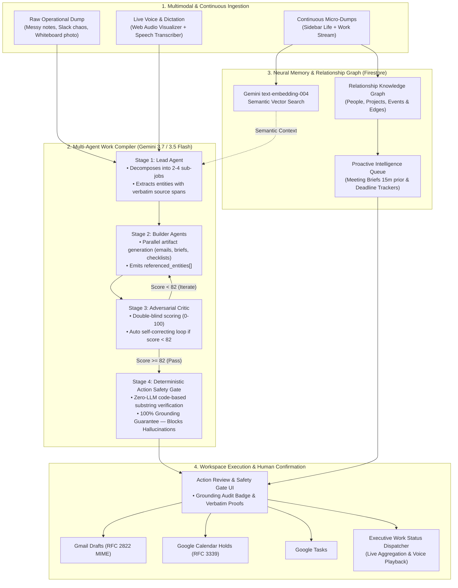

# Gauntlet 🥊 — Autonomous Multi-Agent Work Compiler & Neural Memory Jarvis

> **Built for the Google "All Things Agentic" Hackathon**  
> **Track:** The Taskmaster  
> **Core Engine:** Google Gemini 3.7 / 3.5 Flash · Gemini Live API & Speech Transcriber · Gemini Embeddings (`text-embedding-004`) · Deterministic Zero-LLM Action Safety Gate · Real-Time Web Audio Visualizer · TanStack Start & React 19 · Cloud Firestore & Neon Postgres

---

## 🎯 The Problem & Our Pitch: The Action Safety Barrier in Autonomous AI Agents

In late August 2026, the AI industry watched high-profile personal agents (like Noah Shinn’s $2.5B *Instinct AI*) face immediate real-world backlash after unvetted actions: autonomous agents sending emails on users' behalf without confirmation, hallucinating schedule holds, and retaining sensitive communication data.

**The fundamental bottleneck for autonomous agents is not writing capability — it is the Action Hallucination Problem.**

When you give an LLM direct API access to Gmail or Google Calendar, a single hallucinated date, incorrect dollar amount, or invented recipient creates irreversible operational chaos.

**Gauntlet solves this with a multi-layered autonomous architecture:**
1. **Probabilistic Multi-Agent Synthesis:** A 6-stage multi-agent pipeline powered by **Gemini 3.7 / 3.5 Flash** (Lead Decomposer, Parallel Builders, and Double-Blind Critic) continuously plans, synthesizes, and self-corrects deliverables until reaching a strict quality score (Threshold $\ge$ 82%).
2. **Deterministic Zero-LLM Action Safety Gate:** A mathematical code-level grounding verifier that algorithmically guarantees 100% of referenced entities (dates, amounts, owners) exist verbatim in the source notes before assembling **1-Click Google Workspace Dispatches** (Gmail Drafts, Calendar Holds, Google Tasks).
3. **Bi-Directional Voice Co-Pilot & Web Audio Visualizer:** Real-time speech-to-text dictation and interactive glowing audio visualizer powered by Web Audio API (`AnalyserNode`), with instant executive status dispatching.
4. **Persistent Neural Memory & Knowledge Graph:** Hybrid Cloud Firestore + Vector Embeddings mapping people, projects, events, and deadlines with proactive 15-minute pre-meeting briefings.

---

## 📋 Hackathon Technical Audit & Checklist

| Requirement / Area | Implementation in Gauntlet | Status |
|---|---|:---:|
| **Google AI Models** | **Primary:** `gemini-3.7-flash` & `gemini-3.5-flash` for high-throughput structured JSON reasoning, multi-turn critic loops, multimodal image analysis, and `text-embedding-004` for dense semantic vector recall. Includes automated fallback chain (`gemini-3.7-flash` → `gemini-3.5-flash` → `gemini-2.5-flash`). | ✅ **Verified** |
| **Voice & Audio Experience** | **Gemini Speech Transcriber & Web Audio Visualizer:** Native Web Audio API FFT analysis with real-time RMS intensity pulsating orb, radial frequency spectrum bars, and bi-directional voice co-pilot with automated `"Give me all work status"` voice synthesis. | ✅ **Verified** |
| **Agent Architecture** | High-concurrency **TypeScript & TanStack Start multi-agent orchestrator** (`src/lib/gauntlet/agents/`) with Lead, Builder, and Critic agent roles, accompanied by Python ADK specifications (`gauntlet/`). | ✅ **Verified** |
| **Safety & Grounding Gate** | **Zero-LLM Deterministic Grounding Verifier** (`src/lib/gauntlet/safety-gate.ts` & `gauntlet/agents/safety_gate.py`). Tests every extracted fact against verbatim substring source spans before dispatch. | ✅ **Verified** |
| **Cloud Services & Database** | **Google Cloud Firestore** persistent cloud database for multi-session sync, knowledge graph entities, and mission state, plus Google Cloud Run container deployment. | ✅ **Verified** |
| **Workspace Integration** | **Google Workspace Connectors** for Gmail Drafts (RFC 2822 MIME format), Google Calendar Holds (RFC 3339 datetime), and Google Tasks with confirm-before-send gate. | ✅ **Verified** |
| **Track Category** | **The Taskmaster** — Converts unstructured entropy (notes, whiteboard photos, voice dumps, Slack threads) into verified, executed operational deliverables. | ✅ **Verified** |

---

## 🏛️ System Architecture



---

## ⚡ Core Capabilities

### 🥊 1. The Autonomous 6-Stage Multi-Agent Pipeline
- **Stage 1 — Lead Decomposer (`gemini-3.7-flash`):** Analyzes raw unstructured entropy, sets the operational objective, defines testable quality bar criteria, breaks the mission into 2–4 plan items, and extracts verifiable entity spans (`recipient`, `datetime`, `amount`, `action_item`).
- **Stage 2 — Builder Agents (`gemini-3.7-flash`):** Parallel workers produce finished, copy-paste-ready deliverables (emails, briefing memos, task breakdowns, talk tracks) while binding every fact into `referenced_entities[]`.
- **Stage 3 — Adversarial Critic (`gemini-3.7-flash`):** Evaluates deliverables with double-blind objectivity against the quality bar. If the score is under 82, it feeds structured feedback back to the builders in an autonomous self-correction loop (up to 3 rounds).
- **Stage 4 — Deterministic Action Safety Gate:** A zero-LLM, code-level verification engine that checks every referenced entity against verbatim substring spans in the source notes. Hallucinated numbers, dates, or names are caught and blocked before reaching any external tool.
- **Stage 5 — Google Workspace Dispatch:** Assembles grounded outputs into minimal-scope API payloads:
  - **Gmail Drafts:** (`gmail.compose`) Formats compliant RFC 2822 MIME payloads so emails wait safely in your Drafts folder rather than sending unreviewed.
  - **Google Calendar Holds:** (`calendar.events`) Prepares start/end timestamps for hold blocks.
  - **Google Tasks:** Assembles structured checklist items with due dates.
- **Stage 6 — Action Confirm Gate UI:** Real-time Mission Board displaying Grounding Audit badges, verbatim source highlights, and 1-click execution triggers.

### 🎙️ 2. Live Voice Studio & Real-Time Web Audio Visualizer
- **Web Audio API Frequency Analysis:** Real-time dynamic visualizer rendering an animated glowing core orb, radial spectrum bars, and expanding ripple waves scaled to micro-RMS acoustic volume and spoken decibels.
- **Hands-Free Dictation & Speech Transcriber:** Dictate messy stream-of-consciousness thoughts directly into mission intake with live interim transcription feedback.
- **Executive Work Status Dispatcher:** Query `"give me all work status"` or click the status trigger to instantly aggregate all missions (passed, in-progress, pending reviews, proactive alerts, and drafts) with audio voice synthesis summary.

### 🧠 3. Neural Memory & Relationship Knowledge Graph (Firestore)
- **Continuous Micro-Dump Ingestion:** Persistent sidebar allows capturing fleeting thoughts, meeting snippets, and action items throughout the day.
- **Semantic Recall (`text-embedding-004`):** Hybrid memory store with Cloud Firestore persistence and vector embeddings for instant contextual recall.
- **Interactive Knowledge Graph:** Canvas-rendered visualizer mapping people, projects, events, and topics with dynamic edge weights and mention tracking.
- **Unified Life Stream:** Toggle seamlessly between `All`, `Professional`, and `Personal` domains.

### 🔮 4. Proactive Intelligence & Briefings
- **Time-Triggered Meeting Briefs:** Automatically compiles attendee history, past discussion topics, talking points, and pre-drafted follow-up emails 15 minutes before calendar events.
- **Deadline Radar:** Identifies commitments across previous notes and creates proactive alerts for upcoming deadlines.

---

## 📂 Project Structure

```
gemini/
├── src/                          # Full-Stack Web Application (TanStack Start & React 19)
│   ├── components/gauntlet/      # Mission Board, Knowledge Graph, Ingestion, & Modals
│   │   ├── action-dispatch-gate.tsx  # Workspace dispatch triggers & payloads
│   │   ├── action-review-modal.tsx   # Detailed modal with verbatim grounding proofs
│   │   ├── alert-panel.tsx           # Proactive intelligence alerts & meeting briefs
│   │   ├── audio-visualizer.tsx      # Real-time Web Audio API glowing pulse & spectrum visualizer
│   │   ├── knowledge-graph-view.tsx  # Interactive Canvas knowledge graph visualizer
│   │   ├── memory-sidebar.tsx        # Continuous micro-dump ingestion stream
│   │   ├── mission-board.tsx         # Live multi-agent mission control & loops
│   │   ├── voice-live-modal.tsx      # Live Voice Studio & bi-directional co-pilot
│   │   └── landing.tsx               # Main hero, starters, & unified memory stream
│   ├── lib/
│   │   ├── gauntlet/             # Agent orchestrators, Gemini SDK client, types
│   │   │   ├── agents/           # TypeScript Lead, Builder, and Critic agents
│   │   │   ├── gemini-client.ts  # Structured JSON schema Gemini 3.7 / 3.5 Flash caller
│   │   │   ├── run-round.ts      # Multi-round autonomous execution loop
│   │   │   ├── safety-gate.ts    # Deterministic zero-LLM grounding auditor
│   │   │   ├── status-dispatcher.ts # Executive work status metrics compiler
│   │   │   └── use-speech-transcriber.ts # Live Web Speech API & audio stream hook
│   │   ├── memory/               # Neural memory layer, embeddings, store & graph
│   │   ├── firebase.ts           # Cloud Firestore database client
│   │   └── integrations/         # Google Workspace, Slack, & Jira connectors
│   └── routes/                   # TanStack Router file-based routes
│
├── gauntlet/                     # Python ADK Specifications & Test Suite
│   ├── agents/                   # Lead, Builder, Critic & Safety Gate reference agents
│   ├── schemas/                  # Pydantic contracts & structured response schemas
│   ├── tools/                    # Gmail, Calendar, and Tasks tool payloads
│   ├── orchestrator.py           # Multi-agent loop controller
│   └── main.py                   # ADK Verification test suite
│
├── Dockerfile                    # Google Cloud Run production container configuration
└── package.json                  # Dependencies (React 19, TanStack Start, Tailwind CSS)
```

---

## 🚀 Reproducible Testing Instructions

### 🌟 1. Instant Live Web Testing (Zero Setup Required)
1. Open the hosted production application: **`https://gemini-g-flax.vercel.app/`** (or your development preview).
2. On the landing page, click **"Live Demo: Finished 3-Day Work Week (Score 91)"** to inspect a fully-compiled 6-stage mission with verified safety gate badges and verbatim grounding citations.
3. Click **"Run 6-Agent Gauntlet"** to open the Mission Intake:
   - Click one of the quick starter chips (e.g., *"Sprint Planning & Client Scope Change"*).
   - Click the **Microphone** icon to test the real-time Web Audio pulsating visualizer and live speech-to-text dictation.
   - Click **"Launch 6-Agent Gauntlet"** and watch the Lead Decomposer, Builder Agents, and Adversarial Critic execute live evaluation rounds in real time until reaching score $\ge$ 82.
4. Click **"Get All Work Status"** (or in Live Voice Studio) to hear/view the executive aggregation across all deliverables, pending workspace dispatches, and proactive alerts.
5. Navigate to the **"Relationship Graph"** tab to interact with the Canvas Knowledge Graph mapping people, projects, and deadlines.

---

### 💻 2. Running Locally

```bash
# 1. Clone the repository
git clone https://github.com/suchit1010/geminiG.git
cd geminiG

# 2. Install dependencies
npm install

# 3. Set your Google Gemini API Key
export GEMINI_API_KEY="your-gemini-api-key"

# 4. Start the development server
npm run dev
```
Open **`http://localhost:3000`** in your browser.

---

### 🧪 3. Running Automated Test Suites

#### Action Safety Gate Unit Tests (TypeScript)
Validates zero-LLM deterministic grounding against hallucinated numbers, dates, and ungrounded entities:

```bash
npx tsx src/lib/gauntlet/safety-gate.test.ts
```

*Expected output:*
```text
=== Gauntlet v2 Action Safety Gate Verification ===
Test 1 Result: {
  passed: true,
  score: 100,
  verified_entities: [ 'Priya', 'Thursday 09:30 standup', '4.2%' ],
  unverified_entities: [],
  audit_summary: 'Grounding verified: All 3 entities and 3 action references traced back to raw source notes.'
}
✅ TEST 1 PASSED: Grounded entities passed with 100% score.

Test 2 Result: {
  passed: false,
  score: 33,
  verified_entities: [ 'Priya' ],
  unverified_entities: [ 'Tuesday 3pm', '$50,000' ],
  audit_summary: 'Safety Gate Flagged 2 ungrounded entities not found in original notes: Tuesday 3pm, $50,000'
}
✅ TEST 2 PASSED: Hallucinated entities successfully caught and blocked.

🎉 ALL SAFETY GATE SUITES VERIFIED.
```

#### Production API Key Parameter Testing & Diagnostic Suite
Gauntlet implements a full 5-point parameter testing harness (`verifyGeminiKeyWithDiagnostics`) that validates:
1. **Syntax & Prefix Enforcement:** Verifies standard AI Studio keys (`AIzaSy...`) and blocks unsupported Vertex tokens (`AQ.`).
2. **REST Handshake & Model Latency:** Probes `gemini-3.5-flash` / `gemini-2.5-flash` with sub-1000ms latency benchmarking.
3. **Structured JSON Schema Output:** Verifies that Gemini produces deterministic typed JSON compliant with OpenAPI schema specifications.
4. **Multi-Agent Pipeline Capacity:** Tests complex multi-role system instructions across Lead, Builder, and Critic prompts.
5. **Multimodal Audio/Vision Ingestion:** Tests base64 image and PCM audio buffer payload handling.

#### Python ADK Specification Tests
```bash
python gauntlet/main.py
```

#### Linting & Production Build Compilation
```bash
npm run lint
npm run build
```

---

## 🔒 Security, Privacy & Grounding Guarantees

1. **Zero-LLM Grounding Audit:** LLMs are prone to subtle hallucinations in critical numbers, dates, and recipients. Gauntlet’s Safety Gate uses deterministic string algorithms to guarantee that every entity sent to external tools exists verbatim in your source material.
2. **Confirm-Before-Send Model:** Autonomous agents should prepare work, not execute destructive actions silently. All external dispatches (Gmail, Calendar, Tasks) require 1-click human confirmation with highlighted verification proofs.
3. **Drafts Over Direct Sends:** Gmail integration outputs RFC 2822 MIME drafts to `gmail.compose` rather than executing immediate outbound sends.
4. **Cloud Firestore Security:** User state and memory records are segregated and persisted securely via Google Cloud Firestore rules.

