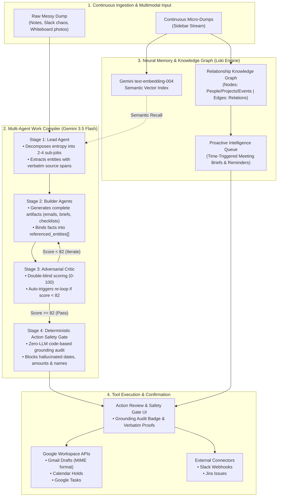

# Gauntlet 🥊 — Autonomous Multi-Agent Work Compiler & Neural Memory Jarvis

> **Built for the Google "All Things Agentic" Hackathon**  
> **Track:** The Taskmaster  
> **Core Stack:** Google Gemini 3.5 Flash · Gemini Embeddings (`text-embedding-004`) · Google Agent Development Kit (ADK) · Google Cloud Run · TanStack Start · React 19 · Neon Postgres / PGLite

---

## 🎯 What is Gauntlet?

Most AI assistants are chat interfaces that output generic outlines and conversational advice, still forcing you to do the actual drafting, entity tracking, verification, and tool dispatch yourself.

**Gauntlet is an autonomous multi-agent work compiler and proactive personal orchestration layer.** 

1. **The Work Compiler:** Dump raw operational entropy (messy Slack threads, Jira tickets, chaotic meeting notes, or photos of whiteboards/sticky notes) and walk away. Three specialized Gemini 3.5 Flash agents plan, build, and adversarial-criticize the deliverables until they pass a strict quality threshold (Score ≥ 82). A **Deterministic Action Safety Gate** validates 100% factual grounding before assembling **1-Click Google Workspace Dispatches** (Gmail Drafts, Calendar Holds, Google Tasks).
2. **The Neural Memory Engine (Loki):** Ingest micro-dumps continuously throughout your day. Gauntlet auto-extracts entities, computes semantic vector embeddings, builds an evolving **Relationship Knowledge Graph** (people, projects, events), and proactively synthesizes **Time-Triggered Meeting Briefs** and pre-drafted follow-ups with a human-in-the-loop confirmation gate.

---

## 📋 Hackathon Compliance Audit

| Requirement | Implementation in Gauntlet | Status |
|---|---|:---:|
| **Gemini 3.5+ Model** | Powered by **Gemini 3.5 Flash** (`gemini-3.5-flash`) for sub-second structured agent reasoning, multimodal image parsing, and `text-embedding-004` for semantic memory retrieval. | ✅ **Compliant** |
| **Google Agent Framework** | Full **Google Agent Development Kit (ADK)** package in [`gauntlet/`](gauntlet/) implementing [`contracts.py`](gauntlet/schemas/contracts.py), [`lead_agent.py`](gauntlet/agents/lead_agent.py), [`builder_agent.py`](gauntlet/agents/builder_agent.py), [`critic_agent.py`](gauntlet/agents/critic_agent.py), and [`safety_gate.py`](gauntlet/agents/safety_gate.py). | ✅ **Compliant** |
| **Google Cloud Service** | Native **Google Cloud Run** containerized deployment with production [`Dockerfile`](Dockerfile) listening on `0.0.0.0:8080`. | ✅ **Compliant** |
| **Google Workspace Tools** | Direct **Google Workspace OAuth2 API Connectors** for Gmail Drafts (`gmail.compose`), Calendar Holds (`calendar.events`), and Google Tasks. | ✅ **Compliant** |
| **Track Category** | **The Taskmaster** — Automates full multi-step operational lifecycles from disorganized dump to verified tool execution without manual hand-holding. | ✅ **Compliant** |

---

## 🏛️ System Architecture



---

## ⚡ Core Capabilities

### 🥊 1. The Autonomous 6-Stage Multi-Agent Pipeline
- **Stage 1 — Lead Agent (`gemini-3.5-flash`):** Reads the raw entropy, establishes the operational objective, defines the quality bar, breaks the work into 2–4 plan items, and extracts verifiable entity spans (`recipient`, `datetime`, `amount`, `action_item`).
- **Stage 2 — Builder Agents (`gemini-3.5-flash`):** Parallelized builders author finished, copy-paste-ready artifacts (emails, briefing memos, task breakdowns, talk tracks) while binding every asserted fact to explicit `referenced_entities[]`.
- **Stage 3 — Adversarial Critic (`gemini-3.5-flash`):** Inspects deliverables double-blind against the quality bar. If the score is under 82, it feeds actionable feedback back to the builders in an autonomous self-correction loop (up to 3 rounds).
- **Stage 4 — Deterministic Action Safety Gate:** A zero-LLM, code-level verification engine that checks every referenced entity against verbatim substring spans in the source notes. Hallucinated numbers, dates, or names are caught and blocked before reaching any API.
- **Stage 5 — Action Dispatch Assembler:** Packages grounded outputs into minimal-scope Google Workspace API payloads (RFC 2822 MIME Gmail drafts, Google Calendar RFC 3339 event holds, Google Tasks).
- **Stage 6 — Human-in-the-Loop Confirmation Gate:** Interactive Mission Board showing grounding badges, quality score breakdown, verbatim source highlights, and 1-click execution triggers.

### 🧠 2. Neural Memory & Relationship Knowledge Graph (Loki)
- **Continuous Micro-Dump Ingestion:** Persistent sidebar allows capturing thoughts, meeting snippets, and action items throughout the day.
- **Semantic Recall (`text-embedding-004`):** Hybrid memory store with Neon Postgres / PGLite vector embeddings and IndexedDB caching for contextual recall.
- **Interactive Knowledge Graph:** Canvas-rendered visualizer mapping people, projects, events, and topics with dynamic edge weights and mention tracking.
- **Unified Life Stream:** Filter effortlessly between `All`, `Professional`, and `Personal` domains.

### 🔮 3. Proactive Intelligence & Briefings
- **Time-Triggered Meeting Briefs:** Automatically compiles attendee history, past discussion topics, talking points, and pre-drafted follow-up emails 15 minutes before calendar events.
- **Deadline & Slippage Radar:** Identifies commitments and creates proactive alerts for upcoming deadlines.

### 🔌 4. Extensible Tool Integrations
- **Google Workspace (OAuth2):** Native support for Gmail Drafts, Calendar holds, and Google Tasks.
- **Connector Plugin Architecture:** Clean TypeScript & Python interfaces for connecting Slack Webhooks and Jira Cloud issues.

---

## 📂 Project Structure

```
gemini/
├── gauntlet/                     # Python Google ADK (Agent Development Kit) Suite
│   ├── agents/                   # Lead, Builder, Critic & Safety Gate agents
│   ├── schemas/                  # Pydantic contracts & structured response schemas
│   ├── tools/                    # Gmail, Calendar, and Tasks tool payloads
│   ├── orchestrator.py           # Multi-agent loop controller
│   └── main.py                   # ADK Verification test suite
│
├── src/                          # Full-Stack Web Application (TanStack Start & React 19)
│   ├── components/gauntlet/      # Mission Board, Knowledge Graph, Ingestion, & Modals
│   │   ├── action-dispatch-gate.tsx  # Workspace dispatch triggers & payloads
│   │   ├── action-review-modal.tsx   # Detailed modal with verbatim grounding proofs
│   │   ├── alert-panel.tsx           # Proactive intelligence alerts & meeting briefs
│   │   ├── knowledge-graph-view.tsx  # Interactive Canvas knowledge graph visualizer
│   │   ├── memory-sidebar.tsx        # Continuous micro-dump ingestion stream
│   │   ├── mission-board.tsx         # Live multi-agent mission control & loops
│   │   └── landing.tsx               # Main hero, starters, & unified memory stream
│   ├── lib/
│   │   ├── gauntlet/             # Agent orchestrators, Gemini SDK client, types
│   │   │   ├── agents/           # TypeScript Lead, Builder, and Critic agents
│   │   │   ├── gemini-client.ts  # Structured JSON schema Gemini 3.5 Flash caller
│   │   │   ├── run-round.ts      # Multi-round autonomous execution loop
│   │   │   └── safety-gate.ts    # Deterministic zero-LLM grounding auditor
│   │   ├── memory/               # Neural memory layer, embeddings, store & graph
│   │   └── integrations/         # Google Workspace, Slack, & Jira connectors
│   └── routes/                   # TanStack Router file-based routes
│
├── migrations/                   # SQL migrations for Postgres (Neon / PGLite)
│   ├── 0001_initial.sql          # Core application schema
│   └── auth/0002_memory.sql      # Memory entries, KG nodes, edges, & alerts
│
├── scripts/                      # Platform verification & build scripts
│   ├── browser-smoke.mjs         # Headless Chromium desktop/mobile smoke test
│   └── migrate.mjs               # Postgres migration runner
│
├── Dockerfile                    # Google Cloud Run production container configuration
└── package.json                  # Dependencies (React 19, TanStack Start, Tailwind v4)
```

---

## 🚀 Spin-up & Quickstart Guide

### Prerequisites
- **Node.js 22+**
- **Google Gemini API Key** ([Get a key here](https://aistudio.google.com/))
- *(Optional)* Python 3.11+ for running the Python ADK test suite

---

### Option 1: Run Full App Locally (Vite Dev Server)

```bash
# 1. Clone the repository
git clone https://github.com/suchit1010/gemini.git
cd gemini

# 2. Install dependencies
npm install

# 3. Set your Google Gemini API Key
# Linux / macOS:
export GEMINI_API_KEY="your-gemini-api-key"
# Windows PowerShell:
$env:GEMINI_API_KEY="your-gemini-api-key"

# 4. Start the application
npm run dev
```
Navigate to **`http://localhost:8080`** in your browser.

---

### Option 2: Deploy to Google Cloud Run (Single Command)

Gauntlet is packaged with a production-ready `Dockerfile` optimized for Google Cloud Run:

```bash
# 1. Authenticate with Google Cloud
gcloud auth login
gcloud config set project YOUR_GCP_PROJECT_ID

# 2. Deploy to Cloud Run
gcloud run deploy gauntlet \
  --source . \
  --platform managed \
  --region us-central1 \
  --allow-unauthenticated \
  --set-env-vars GEMINI_API_KEY="your-gemini-api-key"
```

---

### Option 3: Run Python Google ADK Test Suite

```bash
# Run the Python ADK pipeline tests and safety gate validator
python gauntlet/main.py
```

Expected output:
```text
Running Gauntlet ADK Pipeline Verification Suite...
✅ TEST 1 PASSED: Grounded entities passed with 100% score.
✅ TEST 2 PASSED: Hallucinated entities successfully caught and blocked.
✅ TEST 3 PASSED: Minimal-scope Gmail draft MIME payload generated.

🎉 ALL 3 ADK STAGES VERIFIED.
```

---

## 🧪 Automated Testing & Verification

### 1. Action Safety Gate Unit Tests (TypeScript)
Validates zero-LLM deterministic grounding against hallucinated numbers, dates, and ungrounded entities:

```bash
npx tsx src/lib/gauntlet/safety-gate.test.ts
```

Output:
```text
=== Gauntlet v2 Action Safety Gate Verification ===
✅ TEST 1 PASSED: Grounded entities passed with 100% score.
✅ TEST 2 PASSED: Hallucinated entities successfully caught and blocked.
🎉 ALL SAFETY GATE SUITES VERIFIED.
```

### 2. Full Test Suite & Invariants
```bash
npm test
```

### 3. Type Checking & Production Build
```bash
npm run typecheck
npm run build
```

---

## 🔒 Security, Privacy & Grounding Guarantees

1. **Zero-LLM Grounding Audit:** LLMs are great at drafting but prone to subtle hallucinations in critical numbers or dates. Gauntlet’s Safety Gate uses deterministic string algorithms to guarantee that every entity sent to external tools exists verbatim in your source material.
2. **Confirm-Before-Send Model:** Autonomous agents should prepare work, not execute destructive actions silently. All external dispatches (Gmail, Calendar, Tasks) require 1-click human confirmation with highlighted verification proofs.
3. **Data Isolation:** Memory entries, knowledge graph nodes, and integration tokens are strictly scoped by user ID with secure database constraints.

---

## 👥 Built for Google "All Things Agentic" Hackathon

- **Category:** The Taskmaster
- **Model:** Google Gemini 3.5 Flash & `text-embedding-004`
- **Frameworks:** Google Agent Development Kit (ADK) & TanStack Start / React 19
- **Deployment:** Google Cloud Run
