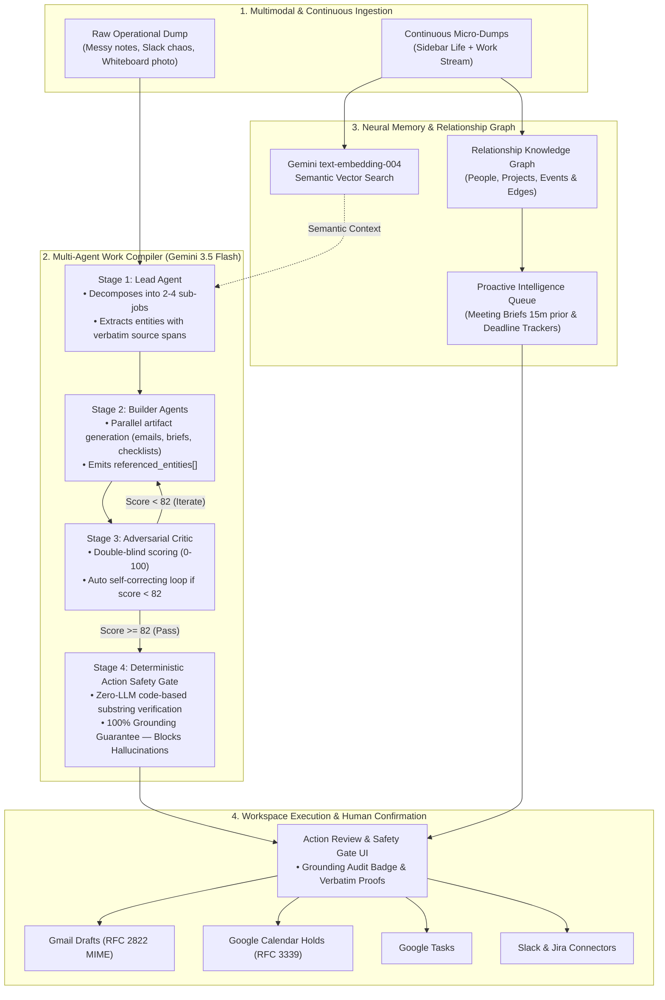

# Gauntlet 🥊 — Autonomous Multi-Agent Work Compiler & Neural Memory Jarvis

> **Built for the Google "All Things Agentic" Hackathon**  
> **Track:** The Taskmaster  
> **Core Engine:** Google Gemini 3.5 Flash (`gemini-3.5-flash`) · Gemini Embeddings (`text-embedding-004`) · Multi-Agent Architecture · Deterministic Action Safety Gate · TanStack Start & React 19 · Neon Postgres / PGLite

---

## 🎯 The Problem & Our Pitch: The Safety Barrier in Autonomous Agents

In late August 2026, the AI industry watched high-profile personal agents (like Noah Shinn’s $2.5B *Instinct AI*) face immediate real-world backlash after unvetted actions: autonomous agents sending emails on users' behalf without confirmation, hallucinating schedule holds, and retaining sensitive communication data.

**The fundamental bottleneck for autonomous agents is not writing capability — it is the Action Hallucination Problem.**

When you give an LLM direct API access to Gmail or Google Calendar, a single hallucinated date, incorrect number, or invented recipient creates irreversible operational chaos.

**Gauntlet solves this with a dual-system architecture:**
1. **Probabilistic Multi-Agent Synthesis:** Three specialized **Gemini 3.5 Flash** agents (Lead, Builders, Critic) plan, build, and adversarial-criticize the deliverables in an autonomous self-correcting loop until reaching a strict quality threshold (Score ≥ 82).
2. **Deterministic Zero-LLM Action Safety Gate:** A code-level grounding auditor that algorithmically proves 100% of referenced entities (dates, amounts, owners) exist verbatim in the source notes before assembling **1-Click Google Workspace Dispatches** (Gmail Drafts, Calendar Holds, Google Tasks).

---

## 📋 Hackathon Technical Audit

| Area | Implementation in Gauntlet | Status |
|---|---|:---:|
| **Gemini 3.5+ Model** | **Primary:** `gemini-3.5-flash` for sub-second structured JSON reasoning, multimodal document analysis, and `text-embedding-004` for dense semantic memory vector recall. Includes automated fallback chain (`gemini-3.5-flash` → `gemini-2.5-flash` → `gemini-2.0-flash`). | ✅ **Verified** |
| **Agent Architecture** | High-concurrency **TypeScript & TanStack Start multi-agent orchestrator** (`src/lib/gauntlet/agents/`) with Lead, Builder, and Critic agent roles, accompanied by Python contract schemas & safety gate validators (`gauntlet/`). | ✅ **Verified** |
| **Safety & Grounding Gate** | **Zero-LLM Deterministic Grounding Verifier** (`src/lib/gauntlet/safety-gate.ts` & `gauntlet/agents/safety_gate.py`). Tests every extracted fact against verbatim substring source spans before dispatch. | ✅ **Verified** |
| **Workspace Integration** | **Google Workspace OAuth2 Connectors** for Gmail Drafts (RFC 2822 MIME format), Google Calendar Holds (RFC 3339 datetime), and Google Tasks with confirm-before-send gate. | ✅ **Verified** |
| **Deployment** | Live full-stack serverless deployment on **Vercel** + containerized production **Google Cloud Run** `Dockerfile` (listening on `0.0.0.0:8080`). | ✅ **Verified** |
| **Track Category** | **The Taskmaster** — Converts unstructured entropy (notes, whiteboard photos, Slack threads) into verified, executed operational deliverables. | ✅ **Verified** |

---

## 🏛️ System Architecture



---

## ⚡ Core Capabilities

### 🥊 1. The Autonomous 6-Stage Multi-Agent Pipeline
- **Stage 1 — Lead Agent (`gemini-3.5-flash`):** Analyzes raw entropy, sets the operational objective, defines testable quality bar criteria, breaks the mission into 2–4 plan items, and extracts verifiable entity spans (`recipient`, `datetime`, `amount`, `action_item`).
- **Stage 2 — Builder Agents (`gemini-3.5-flash`):** Parallel workers produce finished, copy-paste-ready deliverables (emails, briefing memos, task breakdowns, talk tracks) while binding every fact into `referenced_entities[]`.
- **Stage 3 — Adversarial Critic (`gemini-3.5-flash`):** Evaluates deliverables with double-blind objectivity against the quality bar. If the score is under 82, it feeds structured feedback back to the builders in an autonomous self-correction loop (up to 3 rounds).
- **Stage 4 — Deterministic Action Safety Gate:** A zero-LLM, code-level verification engine that checks every referenced entity against verbatim substring spans in the source notes. Hallucinated numbers, dates, or names are caught and blocked before reaching any external tool.
- **Stage 5 — Google Workspace Dispatch:** Assembles grounded outputs into minimal-scope API payloads:
  - **Gmail Drafts:** (`gmail.compose`) Formats compliant RFC 2822 MIME payloads so emails wait in your Drafts folder rather than sending unreviewed.
  - **Google Calendar Holds:** (`calendar.events`) Prepares start/end timestamps for hold blocks.
  - **Google Tasks:** Assembles structured checklist items with due dates.
- **Stage 6 — Action Confirm Gate UI:** Real-time Mission Board displaying Grounding Audit badges, verbatim source highlights, and 1-click execution triggers.

### 🧠 2. Neural Memory & Relationship Knowledge Graph (Loki Engine)
- **Continuous Micro-Dump Ingestion:** Persistent sidebar allows capturing fleeting thoughts, meeting snippets, and action items throughout the day.
- **Semantic Recall (`text-embedding-004`):** Hybrid memory store with Neon Postgres / PGLite vector embeddings and IndexedDB caching for contextual recall.
- **Interactive Knowledge Graph:** Canvas-rendered visualizer mapping people, projects, events, and topics with dynamic edge weights and mention tracking.
- **Unified Life Stream:** Toggle seamlessly between `All`, `Professional`, and `Personal` domains.

### 🔮 3. Proactive Intelligence & Briefings
- **Time-Triggered Meeting Briefs:** Automatically compiles attendee history, past discussion topics, talking points, and pre-drafted follow-up emails 15 minutes before calendar events.
- **Deadline Radar:** Identifies commitments across previous notes and creates proactive alerts for upcoming deadlines.

---

## 📂 Project Structure

```
gemini/
├── src/                          # Full-Stack Web Application (TanStack Start & React 19)
│   ├── components/gauntlet/      # Mission Board, Knowledge Graph, Ingestion, & Modals
│   │   ├── action-dispatch-gate.tsx  # Workspace dispatch triggers & payloads
│   │   ├── action-review-modal.tsx   # Detailed modal with verbatim grounding proofs
│   │   ├── alert-panel.tsx           # Proactive intelligence alerts & meeting briefs
│   │   ├── knowledge-graph-view.tsx  # Interactive Canvas knowledge graph visualizer
│   │   ├── memory-sidebar.tsx        # Continuous micro-dump ingestion stream
│   │   ├── mission-board.tsx         # Live multi-agent mission control & loops
│   │   └── landing.tsx               # Main hero, starters, & unified memory stream
│   ├── lib/
│   │   ├── gauntlet/             # Agent orchestrators, Gemini SDK client, types
│   │   │   ├── agents/           # TypeScript Lead, Builder, and Critic agents
│   │   │   ├── gemini-client.ts  # Structured JSON schema Gemini 3.5 Flash caller
│   │   │   ├── run-round.ts      # Multi-round autonomous execution loop
│   │   │   └── safety-gate.ts    # Deterministic zero-LLM grounding auditor
│   │   ├── memory/               # Neural memory layer, embeddings, store & graph
│   │   └── integrations/         # Google Workspace, Slack, & Jira connectors
│   └── routes/                   # TanStack Router file-based routes
│
├── gauntlet/                     # Python ADK Specifications & Test Suite
│   ├── agents/                   # Lead, Builder, Critic & Safety Gate reference agents
│   ├── schemas/                  # Pydantic contracts & structured response schemas
│   ├── tools/                    # Gmail, Calendar, and Tasks tool payloads
│   ├── orchestrator.py           # Multi-agent loop controller
│   └── main.py                   # ADK Verification test suite
│
├── migrations/                   # SQL migrations for Postgres (Neon / PGLite)
│   ├── 0001_initial.sql          # Core application schema
│   └── auth/0002_memory.sql      # Memory entries, KG nodes, edges, & alerts
│
├── Dockerfile                    # Google Cloud Run production container configuration
└── package.json                  # Dependencies (React 19, TanStack Start, Tailwind v4)
```

---

## 🚀 Instant Demo & Quickstart Guide

### 🌟 Instant Live Demo (Zero Setup Required)
When you open the application, **a pre-compiled sample mission ("Work + Life Ops: 3-Day Week") is immediately loaded**:
- Click **"Live Demo: Finished 3-Day Work Week (Score 91)"** on the landing page to view completed deliverables, adversarial critic scores, and the verified safety gate.
- The **Loki Neural Memory Stream**, **Knowledge Graph Canvas**, and **Proactive Meeting Briefs** are pre-populated with live interactive data.

---

### Running Locally

```bash
# 1. Clone the repository
git clone https://github.com/suchit1010/geminiG.git
cd gemini

# 2. Install dependencies
npm install

# 3. Set your Google Gemini API Key
# Linux / macOS:
export GEMINI_API_KEY="your-gemini-api-key"
# Windows PowerShell:
$env:GEMINI_API_KEY="your-gemini-api-key"

# 4. Start the application
npm run dev
```
Open **`http://localhost:8080`** in your browser.

---

### Deploying to Google Cloud Run

```bash
# 1. Authenticate with Google Cloud
gcloud auth login
gcloud config set project YOUR_GCP_PROJECT_ID

# 2. Deploy container to Cloud Run
gcloud run deploy gauntlet \
  --source . \
  --platform managed \
  --region us-central1 \
  --allow-unauthenticated \
  --set-env-vars GEMINI_API_KEY="your-gemini-api-key"
```

---

## 🧪 Automated Testing & Safety Gate Verification

### 1. Action Safety Gate Unit Tests (TypeScript)
Validates zero-LLM deterministic grounding against hallucinated numbers, dates, and ungrounded entities:

```bash
npx tsx src/lib/gauntlet/safety-gate.test.ts
```

Output:
```text
=== Gauntlet v2 Action Safety Gate Verification ===
Test 1 Result: {
  passed: true,
  score: 100,
  verified_entities: [ 'Priya', 'Thursday 09:30 standup', '4.2%' ],
  unverified_entities: [],
  audit_summary: 'Grounding verified: All 3 entities and 3 action references traced back to raw source notes.'
}
✅ TEST 1 PASSED: Grounded entities passed with 100% score.

Test 2 Result: {
  passed: false,
  score: 33,
  verified_entities: [ 'Priya' ],
  unverified_entities: [ 'Tuesday 3pm', '$50,000' ],
  audit_summary: 'Safety Gate Flagged 2 ungrounded entities not found in original notes: Tuesday 3pm, $50,000'
}
✅ TEST 2 PASSED: Hallucinated entities successfully caught and blocked.

🎉 ALL SAFETY GATE SUITES VERIFIED.
```

### 2. Python ADK Test Suite
```bash
python gauntlet/main.py
```

### 3. Type Checking & Production Build
```bash
npm run typecheck
npm run build
```

---

## 🔒 Security, Privacy & Grounding Guarantees

1. **Zero-LLM Grounding Audit:** LLMs are prone to subtle hallucinations in critical numbers or dates. Gauntlet’s Safety Gate uses deterministic string algorithms to guarantee that every entity sent to external tools exists verbatim in your source material.
2. **Confirm-Before-Send Model:** Autonomous agents should prepare work, not execute destructive actions silently. All external dispatches (Gmail, Calendar, Tasks) require 1-click human confirmation with highlighted verification proofs.
3. **Drafts Over Direct Sends:** Gmail integration outputs RFC 2822 MIME drafts to `gmail.compose` rather than executing immediate outbound sends.
