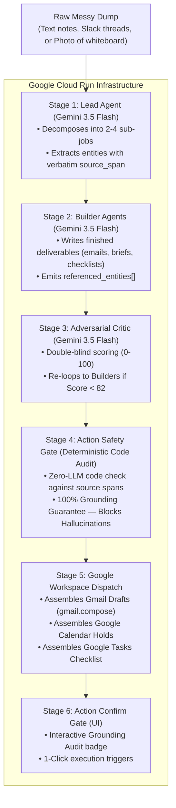

# Gauntlet 🥊 — Autonomous Multi-Agent Work Compiler

> **Built for the Google "All Things Agentic" Hackathon**  
> **Track:** The Taskmaster  
> **Core Stack:** Google Gemini 3.5 Flash · Google Agent Development Kit (ADK) · Google Cloud Run

---

## 🎯 What is Gauntlet?

Most AI assistants are chatbots that output advice and generic outlines, forcing you to do the actual writing and scheduling yourself.

**Gauntlet is an autonomous multi-agent work compiler.** You dump raw operational chaos (messy Slack threads, Jira tickets, disorganized thoughts, or a photo of handwritten notes/whiteboards) and walk away. Three specialized Gemini agents plan, build, and adversarial-criticize the deliverables until they pass a strict quality threshold, verified by a **Deterministic Action Safety Gate** and prepared for **1-Click Google Workspace Dispatch** (Gmail Drafts, Calendar holds, Google Tasks).

---

## 📋 Hackathon Compliance Audit

| Requirement | Implementation in Gauntlet | Status |
|---|---|:---:|
| **Gemini 3.5+ Model** | Powered by **Gemini 3.5 Flash** (`gemini-3.5-flash`) with native multimodal vision, sub-second latency, and structured `responseSchema` contracts. | ✅ **Compliant** |
| **Google Agent Framework** | Full **Google Agent Development Kit (ADK)** package in `gauntlet/` implementing `contracts.py`, `lead_agent.py`, `builder_agent.py`, `critic_agent.py`, and `safety_gate.py`. | ✅ **Compliant** |
| **Google Cloud Service** | Native **Google Cloud Run** containerized deployment (`Dockerfile` + Cloud Run server on `0.0.0.0:8080`). | ✅ **Compliant** |
| **Track Category** | **The Taskmaster** — Automates full multi-step operational workflows from raw dump to final dispatch without hand-holding. | ✅ **Compliant** |

---

## 🏛️ System Architecture



---

## ⚡ The 6-Stage Autonomous Pipeline

1. **Stage 1 — Lead Agent (Gemini 3.5 Flash):** Decomposes entropy into 2–4 plan items and extracts all grounded entities (`recipient`, `datetime`, `amount`, `action_item`) with exact `source_span` substring proof from the notes.
2. **Stage 2 — Builder Agents (Gemini 3.5 Flash):** Generates concrete, copy-paste-ready artifacts (emails, checklists, talk tracks) while binding every fact into `referenced_entities[]`.
3. **Stage 3 — Adversarial Critic (Gemini 3.5 Flash):** Evaluates outputs with double-blind objectivity against the quality bar. If `score < 82`, the orchestrator triggers an automatic self-correction loop.
4. **Stage 4 — Deterministic Action Safety Gate:** A zero-LLM, code-based grounding validator that proves every entity referenced in the output exists in the raw source notes. Blocks any hallucinated dates or numbers before dispatch.
5. **Stage 5 — Google Workspace Dispatch:** Prepares safe, minimal-scope dispatch payloads:
   - **Gmail Drafts** (`gmail.compose`)
   - **Google Calendar Holds** (`calendar.events`)
   - **Google Tasks**
6. **Stage 6 — Action Confirm Gate UI:** Displays the Grounding Audit badge with 1-click triggers in the real-time Mission Board.

---

## 🚀 Spin-up Instructions (Reproducibility Guide)

### Option 1: Run Locally

```bash
# 1. Clone the repository
git clone https://github.com/suchit1010/gemini.git
cd gemini

# 2. Install dependencies
npm install

# 3. Set your Google Gemini API key
export GEMINI_API_KEY="your-gemini-api-key"
# Windows PowerShell: $env:GEMINI_API_KEY="your-gemini-api-key"

# 4. Start the dev server
npm run dev
```
Open **`http://localhost:8080`** in your browser.

---

### Option 2: Deploy to Google Cloud Run (1 Command)

```bash
# Authenticate with Google Cloud
gcloud auth login
gcloud config set project YOUR_GCP_PROJECT_ID

# Deploy to Cloud Run
gcloud run deploy gauntlet \
  --source . \
  --platform managed \
  --region us-central1 \
  --allow-unauthenticated \
  --set-env-vars GEMINI_API_KEY="your-gemini-api-key"
```

---

### Option 3: Run Google ADK Python Suite

```bash
# Run the Python ADK test suite and safety gate verifier
python gauntlet/main.py
```

---

## 🧪 Safety Gate Automated Verification

Unit tests are included in [`src/lib/gauntlet/safety-gate.test.ts`](src/lib/gauntlet/safety-gate.test.ts):

```bash
npx tsx src/lib/gauntlet/safety-gate.test.ts
```

Output:
```
=== Gauntlet v2 Action Safety Gate Verification ===
✅ TEST 1 PASSED: Grounded entities passed with 100% score.
✅ TEST 2 PASSED: Hallucinated entities successfully caught and blocked.
🎉 ALL SAFETY GATE SUITES VERIFIED.
```

---
